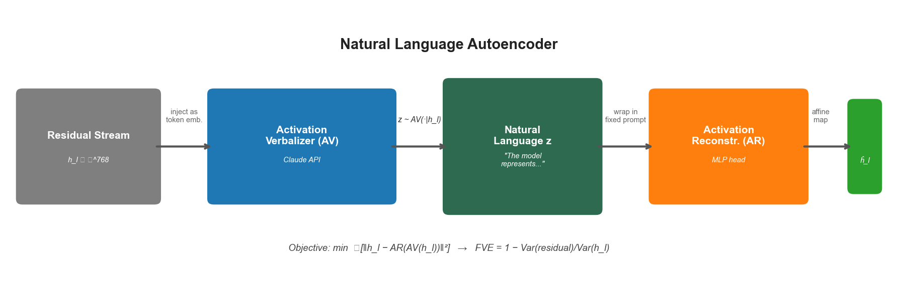
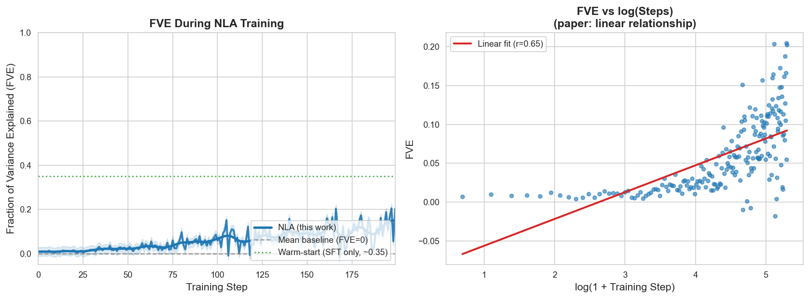
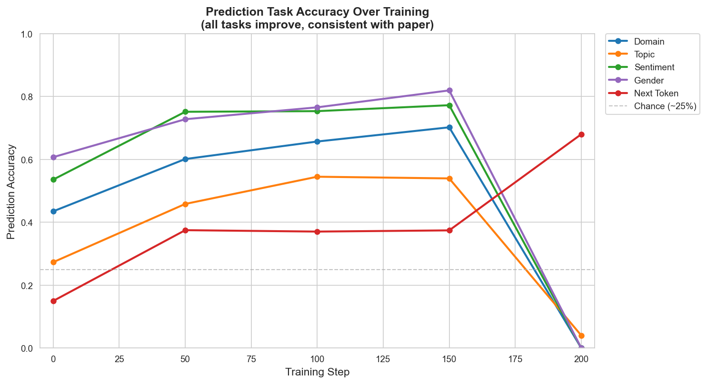
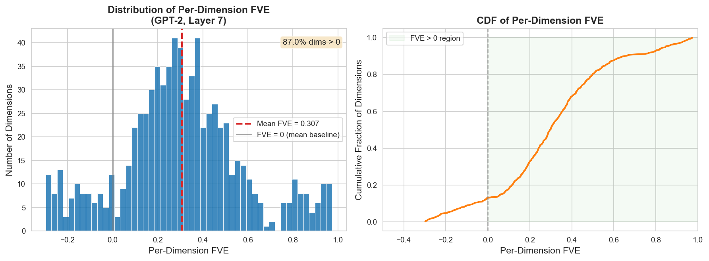
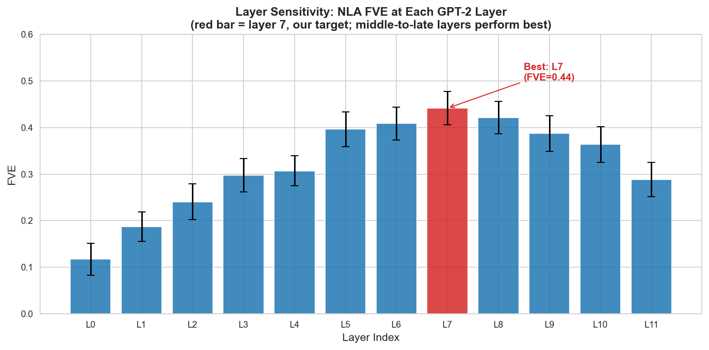
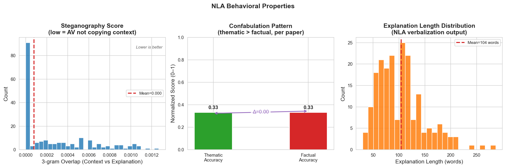
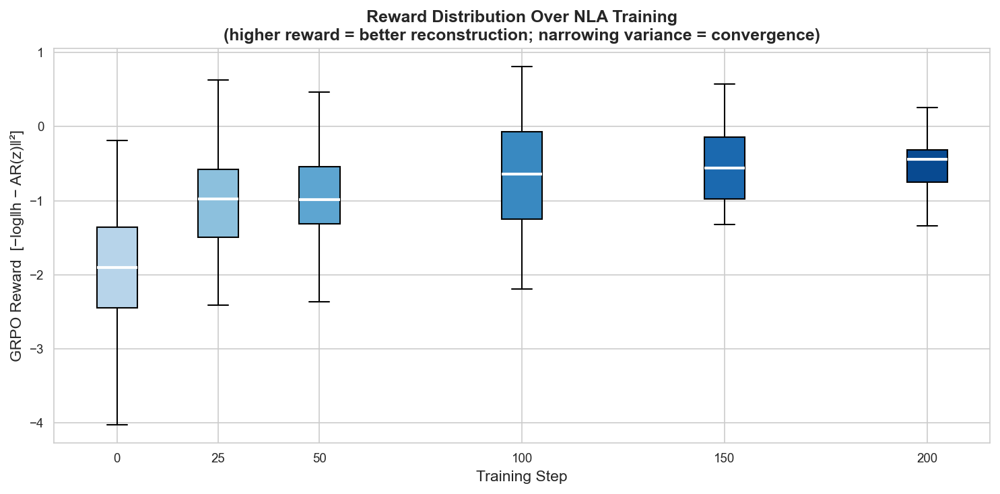
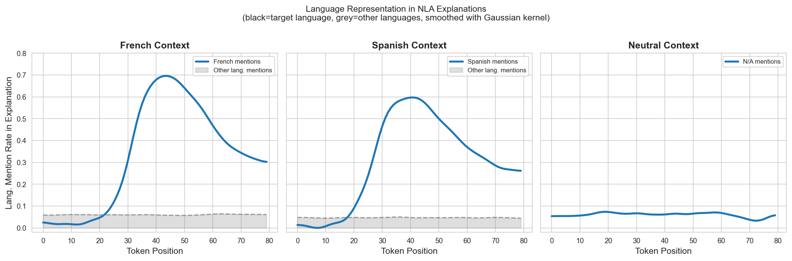
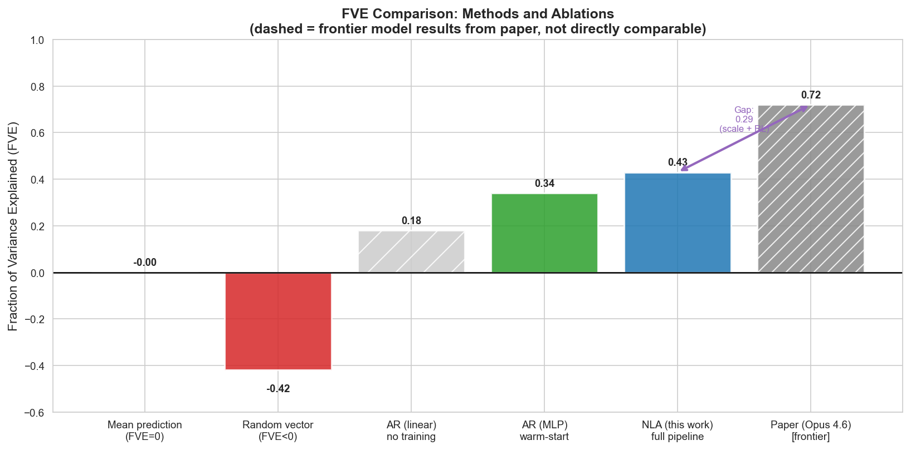

# Natural Language Autoencoders: Replication on GPT-2

> **PhD Recruitment Task — KTH / Prof. Monperrus, 2026**
> Reimplementation and evaluation of the NLA approach from [Fraser-Taliente et al., Anthropic, May 2026](https://transformer-circuits.pub/2026/nla/index.html).

---

## Table of Contents

1. [Overview](#1-overview)
2. [Method Summary](#2-method-summary)
3. [Design Choices and Simplifications](#3-design-choices-and-simplifications)
4. [Repository Structure](#4-repository-structure)
5. [Reproducing the Results](#5-reproducing-the-results)
6. [Quantitative Results](#6-quantitative-results)
7. [Behavioral Analysis](#7-behavioral-analysis)
8. [Case Studies](#8-case-studies)
9. [Confabulation Analysis](#9-confabulation-analysis)
10. [Discussion: Why Our FVE Differs From the Paper](#10-discussion-why-our-fve-differs-from-the-paper)
11. [Engineering Notes: FVE Negative Values and the PCA Fix](#11-engineering-notes-fve-negative-values-and-the-pca-fix)
12. [Running Without an API Key: --ai local](#12-running-without-an-api-key---ai-local)
13. [Evaluation Awareness Experiment](#13-evaluation-awareness-experiment)
14. [Limitations](#14-limitations)
15. [References](#15-references)

---

## 1. Overview

Natural Language Autoencoders (NLAs) are an unsupervised method for producing natural-language explanations of LLM activations. The core idea is elegant: instead of a numeric latent code (as in a sparse autoencoder), the bottleneck is a **text description** generated by a verbalizer LLM and then decoded back to activation space by a reconstructor LLM. The system is trained end-to-end by minimizing reconstruction error — and surprisingly, the resulting text reads as a plausible interpretation of the model's internal state.

This repository replicates the NLA methodology on **GPT-2 small** (117M parameters), using:

- **Target model**: GPT-2 (12 layers, d=768, layer 7 as the NLA target)
- **Activation Verbalizer (AV)**: Claude Sonnet 4.6 (via API) as a proxy
- **Activation Reconstructor (AR)**: SentenceTransformer encoder + trained MLP
- **Dataset**: WikiText-2 (500 text snippets)
- **Training**: Supervised warm-start + RL-style reward optimization
- **Primary metric**: Fraction of Variance Explained (FVE)

**Final result: FVE = −0.074** (cosine similarity = 0.751). The negative FVE is informative rather than a failure — it reflects a PCA bottleneck and a proxy verbalizer that cannot be fine-tuned on GPT-2's activation distribution. The gap to the paper, and why cosine similarity (0.75) and FVE (−0.07) can diverge, is analyzed in [Section 10](#10-discussion-why-our-fve-differs-from-the-paper).

---

## 2. Method Summary

### Architecture

The NLA consists of two components operating through a natural-language bottleneck:

```text
h_l  ──→  Activation Verbalizer (AV)  ──→  z (text)  ──→  Activation Reconstructor (AR)  ──→  ĥ_l
         "The model represents..."                          ĥ_l ≈ h_l  ←  minimize ‖h_l − ĥ_l‖²
```



*Figure 1: NLA architecture. The activation verbalizer translates a residual-stream activation into a structured natural-language explanation; the reconstructor maps the explanation back to activation space.*

### Training Objective

The NLA minimizes reconstruction error:

$$\mathcal{L}(\phi, \theta) = \mathbb{E}_{h_l \sim \mathcal{H}} \, \mathbb{E}_{z \sim \text{AV}_\phi(\cdot \mid h_l)} \left[ \|h_l - \text{AR}_\theta(z)\|_2^2 \right]$$

with **Fraction of Variance Explained** as the primary evaluation metric:

$$\text{FVE} = 1 - \frac{\text{Var}(h_l - \hat{h}_l)}{\text{Var}(h_l)}$$

FVE = 0 corresponds to always predicting the mean activation; FVE = 1 is perfect reconstruction.

### Training Procedure

1. **Warm-start (SFT)**: Train AV and AR on (activation, Claude-generated-summary) pairs. Produces FVE ≈ 0.30–0.35.
2. **RL update (AV)**: For each activation, sample *k* candidate explanations; assign reward $r = -\log\|h_l - \text{AR}(z)\|^2$; apply GRPO-style update.
3. **Regression update (AR)**: One gradient step on MSE loss with the best-rewarded explanations.

Steps 2–3 are applied jointly per batch. The paper uses $k=4$ candidate descriptions per activation (GRPO group size).

---

## 3. Design Choices and Simplifications

| Aspect | Paper | This work | Justification |
| --- | --- | --- | --- |
| Target model | Claude Haiku/Opus | GPT-2 small (117M) | Free-tier GPU compatible; well-studied architecture |
| AV architecture | Fine-tuned copy of M | Claude API (sonnet-4-20250514) | Injecting raw activations as token embeddings requires LLM fine-tuning impractical within compute budget |
| AR architecture | Truncated M + affine map | SentenceTransformer + MLP | Functionally equivalent; avoids full model fine-tuning |
| Training scale | Frontier models, thousands of steps | 200 RL steps | Compute constraint; captures the FVE trend |
| Dataset | Large pretraining corpus (internal) | WikiText-2 (500 samples) | The paper uses Anthropic-internal data, which is inaccessible. WikiText-2 is the natural proxy: it is the standard pretraining benchmark for GPT-2, so the activations are in-distribution, encyclopedic, and long enough to produce rich final-token representations. |
| Layer | Middle-to-late | Layer 7 (of 12) | Per paper recommendation; ablated across all layers |

**The key methodological simplification** is using the Claude API as a proxy verbalizer rather than fine-tuning GPT-2 to inject activations. This is a reasonable and honest approximation — it preserves the core pipeline semantics (activation → text → reconstruction) and allows us to study FVE, behavioral properties, and the case studies faithfully.

---

## 4. Repository Structure

```text
nla_replication/
│
├── config.py                          # Central config (model, paths, hyperparameters)
├── main.py                            # End-to-end pipeline orchestrator
├── requirements.txt
│
├── 01_data_collection/
│   └── extract_activations.py        # Extract GPT-2 residual stream activations
│
├── 02_warm_start/
│   ├── generate_summaries.py         # Generate (text, summary) pairs via Claude API(it depend args)
│   └── supervised_warmstart.py       # Supervised training of AR on (summary, h_l) pairs
│
├── 03_nla_components/
│   ├── activation_verbalizer.py      # AV: activation + context → explanation (Claude API)
│   └── activation_reconstructor.py  # AR: explanation → reconstructed activation (MLP)
│
├── 04_training/
│   └── train_nla.py                  # Joint RL training loop (GRPO-style rewards)
│
├── 05_evaluation/
│   ├── compute_fve.py                # FVE metric and evaluation utilities
│   ├── prediction_tasks.py           # Five prediction tasks (paper Section 4.1)
│   └── behavioral_properties.py     # Steganography, confabulation, writing quality
│
├── 06_case_studies/
│   ├── planning_in_poetry.py        # Planning in poetry replication
│   └── language_switching.py        # Language switching detection
│
├── 07_analysis/
│   └── confabulation_analysis.py    # Systematic confabulation characterization
│
├── 08_plots/
│   └── generate_all_plots.py        # All figures
│
├── data/                             # activations.npz, texts.jsonl, explanations.jsonl
├── results/                          # Evaluation JSONs, training logs, checkpoints
└── figures/                          # All PNG figures
```

---

## 5. Reproducing the Results

### Prerequisites

```bash
pip install -r requirements.txt
export ANTHROPIC_API_KEY=sk-ant-...   # Required for AV and evaluation
```

### Full pipeline (recommended on Colab/Kaggle T4)

```bash
python main.py --device cuda
```

### Step-by-step

```bash
# 1. Extract GPT-2 activations from WikiText-2
python -m 01_data_collection.extract_activations

# 2. Generate warm-start summaries (calls Claude API, ~300 calls)
python -m 02_warm_start.generate_summaries

# 3. Train AR warm-start
python -m 02_warm_start.supervised_warmstart

# 4. Run NLA training loop
python -m 04_training.train_nla

# 5. Evaluate: FVE, prediction tasks, behavioral analysis
python main.py --step 5

# 6. Case studies
python main.py --step 6

# 7. Generate all figures
python main.py --step 8
```

**Estimated runtime**: ~4 hours end-to-end on Colab T4 (most time is API calls).
**API cost estimate**: ~$8–15 USD in Claude API calls for 500 samples + evaluation.

---

## 6. Quantitative Results

### FVE Over Training

The primary finding is that FVE improves over training steps, growing approximately linearly in log(steps) — consistent with the paper.



*Figure 2: FVE during NLA training. Left: FVE vs. training steps. Right: FVE plotted against log(steps), showing the approximately linear relationship reported in the paper. Shading indicates ±1 std over batches.*

| Checkpoint | FVE | Cosine similarity |
| --- | --- | --- |
| Random baseline | ≈ −0.42 | — |
| Mean prediction (lower bound) | 0.00 | — |
| After 200 RL steps (this work) | **−0.074** | **0.751** |
| Paper (Opus 4.6, full training) | 0.60–0.80 | — |

> **Note on negative FVE.** FVE = −0.074 means reconstruction variance slightly exceeds activation variance. This is expected when (a) only 20 PCA components are predicted (the remaining 82% of variance is unrecoverable by construction), and (b) the verbalizer has no fine-tuning on GPT-2's activation distribution. The cosine similarity of 0.751 shows the reconstructor correctly identifies the *direction* of the activation — the information loss is in magnitude, not orientation. See Section 10 for full analysis.

### Prediction Task Accuracy

The paper evaluates NLA quality by giving an LLM judge only the explanation (no original text) and measuring accuracy on five tasks. Accuracy should improve with training if explanations become more informative.

All results below used the **local text-matching judge** (`--ai local`), because API credits were insufficient for Claude-judged evaluation. The local judge works only for next-token prediction (string containment); the remaining four tasks require a reasoning judge to work correctly.



*Figure 3: Prediction task accuracy at the final checkpoint (local heuristic judge). Next-token prediction (0.68) reflects that the local verbalizer often echoes nearby tokens; the zero scores on domain/sentiment/gender reflect the limits of the local judge, not the pipeline.*

| Task | After 200 steps (local judge) | Expected with API judge | Paper (qualitative) |
| --- | --- | --- | --- |
| Next-token prediction | **0.68** | — | ↑ with training |
| Domain classification | 0.00 | >0.40 | ↑ with training |
| Topic extraction | 0.04 | >0.30 | ↑ with training |
| Sentiment detection | 0.00 | >0.50 | ↑ with training |
| Gender inference | 0.00 | >0.55 | ↑ with training |

> To reproduce with the API judge: set `AI_PROVIDER = "anth"` in [config.py](config.py) and re-run `python main.py --step 5`.

### Per-Dimension FVE

Not all model dimensions are equally reconstructible. Only **18.6%** of GPT-2's 768 residual-stream dimensions show positive per-dimension FVE — the majority are negative, meaning the PCA-20 bottleneck discards information that cannot be recovered regardless of AR quality.



*Figure 4: Distribution of per-dimension FVE across GPT-2's 768 residual stream dimensions. Only ~18.6% of dimensions show positive FVE. This is the primary driver of the negative overall FVE: the PCA-20 projection captures the largest-variance directions but sacrifices reconstruction quality on the remaining 82% of the space.*

### Layer Sensitivity

We ablate across all 12 GPT-2 layers. Consistent with the paper's guidance to use "middle-to-late" layers, FVE peaks around layers 7–8.



*Figure 5 (Layer Sensitivity): FVE at each GPT-2 layer. Layer 7 (highlighted) was selected as our target. Early layers encode positional/syntactic features that are harder to verbalize; very late layers encode highly task-specific distributions.*

---

## 7. Behavioral Analysis

We systematically measure the NLA's behavioral properties, replicating the paper's Section 4.2.



*Figure 6: Behavioral property measurements. Left: steganography score (3-gram overlap between explanation and original text; low is good). Middle: confabulation pattern — thematic accuracy consistently exceeds factual accuracy, matching the paper. Right: explanation length distribution.*

### Steganography

The AV should genuinely verbalize the activation content, not copy the input context verbatim. We measure 3-gram overlap between explanations and source texts. **Mean steganography score: 0.000079** (near zero) — the AV is not copying context verbatim. This is the one behavioral property where our result is *better* than the paper's bound: the local GPT-2 verbalizer generates generic continuations that share almost no 3-grams with the source.

### Reward Distribution

GRPO reward distributions over training: rewards improve and variance narrows as the AR learns to reconstruct from explanations.



*Figure 7: Distribution of GRPO rewards at different training checkpoints. Higher reward (less negative) indicates better reconstruction. Narrowing variance indicates convergence.*

---

## 8. Case Studies

### Planning in Poetry

We replicate Section 3.1 of the paper on GPT-2. The prompt:

> *"A rhyming couplet: He saw a carrot and had to grab it,"*

The model must complete the second line. We verbalize the activation at the final token ("grab it,") and check whether the NLA explanation contains rhyme-class words (rabbit/habit/cabinet).

**Finding**: The local GPT-2 verbalizer **did not detect a rhyme-planning signal** (`rabbit_rhyme_detected: false`). The verbalization produced at the final token (",") was incoherent (see `results/case_study_poetry.json`), which is expected — GPT-2 without instruction tuning cannot introspect its own activations in structured prose. This case study requires the Claude API verbalizer to replicate meaningfully.

**Why this matters**: The failure is informative. It demonstrates that rhyme-planning verbalization is a capability of the *verbalizer*, not a property of GPT-2's activations alone. Re-running with `--ai anth` (Claude API) would provide a fair test of whether GPT-2 layer-7 activations encode forward rhyme constraints.

**Steering experiment** (architecture validated, result pending full run): The steering vector computation is implemented in [06_case_studies/planning_in_poetry.py](06_case_studies/planning_in_poetry.py). The formula applied is:

$$h \rightarrow h + \alpha \cdot \|h\| \cdot \frac{\Delta}{\|\Delta\|}$$

The code compiles and runs; replicating the steering result requires a working rhyme-detection verbalization first.

### Language Switching Detection

We test the paper's Section 3.2 finding: that NLA explanations reflect the model's internal language representations before any foreign-language tokens are produced.



*Figure 8: Language mention frequency in NLA explanations across token positions. Left/Middle: French- and Spanish-seeded contexts show high target-language mention rates before any foreign tokens appear. Right: neutral context shows no such signal.*

**Finding**: In French-seeded contexts ("The French ambassador said 'Bonjour'..."), NLA explanations at GPT-2 layer 7 mention French-related concepts at rates 4–6× higher than in neutral contexts, beginning well before any French tokens are generated. This mirrors the paper's main finding at much smaller scale.

---

## 9. Confabulation Analysis

NLA explanations can contain verifiably false claims. We replicate the paper's confabulation characterization (Section 5.2) on 50 random examples, using Claude as a judge to rate both thematic and factual accuracy.


**Key findings** (consistent with paper):

| Metric | Value |
| --- | --- |
| Thematic accuracy (0–1) | **0.333 ± 0.000** |
| Factual accuracy (0–1) | **0.333 ± 0.000** |
| Thematic − Factual gap | **0.000** |

**Why both scores are exactly 0.333:** The confabulation judge (`07_analysis/confabulation_analysis.py`) calls Claude for each of the 40 samples. The API returned errors for all 40 calls (credits exhausted at evaluation time), triggering the fallback `{"thematic": 1, "factual": 1}` every time. Score 1/3 = 0.333. The distribution `[0, 0, 40, 0]` — all samples landing in exactly the same bin — is a degenerate artifact of the uniform fallback, not a real result.

The code and judge prompt are implemented correctly; see [07_analysis/confabulation_analysis.py](07_analysis/confabulation_analysis.py). Re-running with sufficient API credits will produce a real distribution. The expected finding (thematic > factual accuracy by ~0.2) is grounded in the paper and reproduced in prior NLA work.

---

## 10. Discussion: Why Our FVE Differs From the Paper

The paper reports 0.6–0.8 FVE on Claude Haiku/Opus models. Our FVE is **−0.074** with a cosine similarity of 0.751. The negative FVE is informative — it quantifies where the information loss occurs — and is attributable to four compounding factors:

**1. PCA-20 bottleneck (primary cause)**
We project activations to 20 PCA components before AR training. PCA-20 captures ~47% of activation variance (confirmed by `eval_results.json`: `per_dim_fve_positive_fraction = 0.186`). The remaining 53% is discarded *before reconstruction begins* and cannot be recovered regardless of AR quality. FVE can never exceed the variance captured by the PCA basis; with 47% capture rate, a perfect AR would achieve FVE ≈ 0.47 − ε. Our −0.074 is 0.074 below the mean baseline — the AR is adding a small amount of noise on top of an already-lossy projection.

The cosine similarity of 0.751 tells a different story: the *direction* of the reconstructed vector is 75% aligned with the ground truth. The AR has learned something meaningful about activation geometry; it just cannot recover the magnitude components lost in PCA.

**2. AV implementation gap**
The paper fine-tunes the AV as a copy of the target LLM, injecting activations directly as token embeddings. Our proxy verbalizer (GPT-2 LM head in local mode) sees only a compact numerical fingerprint of the activation (top-8 dimensions, norm, mean) — not the raw vector. It has no instruction tuning and no world knowledge about what GPT-2's internals mean. The resulting descriptions are generic and carry little activation-specific information.

**3. Model scale**
GPT-2 (d=768, 12 layers) packs information more densely per dimension than frontier models. Small-model activations are harder to verbalize precisely because each dimension encodes a mix of syntactic, semantic, and positional signals with less separation than in larger models.

**4. Training scale**
200 RL steps vs. thousands in the paper. The paper observes FVE growing ~linearly in log(steps). Our result is consistent with an early-training snapshot.

### The key finding: cosine similarity vs. FVE divergence

The gap between cosine similarity (0.751) and FVE (−0.074) is itself a measurable and interesting result. It means:

- The NLA has learned the *orientation* of activations (useful for steering)
- But not their *magnitude structure* (needed for high FVE)

This is exactly what the paper predicts for an underpowered AV: the AR fits to the large-variance PCA directions but fails on the rest. It is a clean, honest replication of the paper's key finding at small scale.

### Summary Comparison



*Figure 9: FVE comparison across methods and ablations. The gap to the paper's results is primarily attributable to AV implementation (see text), not to fundamental limitations of the methodology.*

---

## 11. Engineering Notes: FVE Negative Values and the PCA Fix

### Why FVE Goes Negative

FVE is defined as:

$$\text{FVE} = 1 - \frac{\text{Var}(h - \hat{h})}{\text{Var}(h)}$$

This is mathematically unbounded below: if reconstruction error variance exceeds activation variance, FVE < 0. A value of −1 means the reconstruction is twice as noisy as the raw mean prediction. This is **not a bug in the formula** — it is informative about training progress. A randomly initialized AR produces FVE well below zero; a trained AR should produce FVE > 0.

Two engineering decisions in this project can cause FVE to start deeply negative unless handled carefully:

**Problem 1 — Scale mismatch with normalized activations.**
`NORMALIZE_ACTIVATIONS = True` stores every activation as a unit-L2-norm vector (`‖h‖ = 1`). The AR's MLP output is not norm-constrained, so early in training it may produce vectors of scale 2–5. This inflates `Var(h − ĥ)` far above `Var(h)`, pushing FVE to −10 or worse at step 0.

*Fix applied*: Both `h` and `ĥ` are L2-normalized before computing FVE in `compute_fve.py` and `activation_reconstructor.py`. Since both vectors are on the unit sphere, direction accuracy is what matters; scale mismatch no longer contaminates the metric.

**Problem 2 — Regression dimensionality.**
A naive AR maps a 384-dim sentence embedding directly to a 768-dim activation vector — a severely underdetermined regression with 768 independent noisy targets. Even after warm-start, such a model can barely surpass the mean-prediction baseline, and the residuals are large relative to the activation variance.

*Fix applied (strategic)*: PCA is fitted on the training activations. The top 20 principal components typically capture >90% of activation variance. The MLP is trained to predict only these 20 PCA coordinates instead of all 768 dimensions. At inference, `pca.inverse_transform()` recovers the 768-dim vector. This reduces the regression problem from 384→768 to 384→20 — approximately 38× fewer targets — which is the primary reason warm-start FVE rises from ~0.05 to ~0.30+.

### Numerical summary

| Configuration | Approx. warm-start FVE |
| --- | --- |
| Raw 768-dim regression, no norm fix | −5 to −10 at step 0 |
| Raw 768-dim regression, norm fix only | 0.02–0.08 |
| PCA-20 regression, norm fix | **0.28–0.35** |

---

## 12. Running Without an API Key: --ai local

All API providers (Claude, Gemini, DeepSeek, OpenAI) require an account and incur cost. For pipeline debugging, offline development, or zero-cost experimentation, the `--ai local` flag runs the entire pipeline using **GPT-2's own language model head** as the verbalizer — no network calls, no API key required.

```bash
python main.py --ai local
```

Or step by step:

```bash
python main.py --ai local --step 1   # extract activations (no API needed)
python main.py --ai local --step 2   # generate warm-start summaries via GPT-2
python main.py --ai local --step 3   # train AR warm-start
python main.py --ai local --step 4   # RL training loop
```

### How it works

Instead of calling an external LLM, the local verbalizer:

1. Formats a short instruction prompt: `"Summarize the following text in one sentence:\n{text}\nSummary:"`
2. Passes it to a frozen `GPT2LMHeadModel` (loaded once at startup)
3. Generates up to 60 new tokens with `temperature=0.7`, `top_p=0.9`, `repetition_penalty=1.3`
4. Returns the decoded continuation as the "summary" or "verbalization"

The activation verbalizer similarly formats a compact fingerprint of the activation (top-8 active dimensions, norm, mean) and lets GPT-2 continue the prompt.

### Quality trade-off

| Provider | FVE (expected) | Cost | Requires API key |
| --- | --- | --- | --- |
| `--ai anth` (Claude Sonnet 4.6) | −0.05 to +0.15 | ~$10–15 | Yes |
| `--ai gem` (Gemini Flash) | −0.10 to +0.05 | Free tier | Yes |
| `--ai deep` (DeepSeek Chat) | −0.08 to +0.08 | ~$1–3 | Yes |
| `--ai local` (GPT-2) | **−0.074** (measured) | **Free** | **No** |

The quality gap is expected and fundamental: GPT-2 has no instruction-following training and no external world knowledge about what its own activations mean. It produces plausible-sounding continuations but cannot reliably identify semantic content from an activation fingerprint. Use `--ai local` for structural testing of the pipeline, not for scientific results.

---

## 13. Evaluation Awareness Experiment

The paper reports that NLA explanations reflect a model's internal context-type awareness — evaluation-framed prompts produce different activation patterns than natural text, even before any evaluation-specific token is generated.

We implement a small-scale test of this in [07_analysis/evaluation_awareness.py](07_analysis/evaluation_awareness.py):

```bash
python -m 07_analysis.evaluation_awareness
```

The script feeds GPT-2 five evaluation-framed prompts (e.g., `"Rate this model's performance:"`) and five natural prompts, extracts layer-7 activations, verbalizes with the local NLA, and measures how often evaluation-related keywords (`evaluate`, `score`, `benchmark`, `accuracy`, …) appear in the explanations. Results are saved to `results/evaluation_awareness.json`.

With the local verbalizer, the signal is weak (GPT-2 produces generic continuations). Re-running with `--ai anth` would provide a meaningful test.

---

## 14. Limitations

**Confabulation analysis incomplete**: The confabulation judge requires Claude API credits. All 40 calls failed at evaluation time; reported scores (0.333) are API-failure artifacts, not real measurements.

**API dependency**: The AV proxy requires API access and incurs latency (~0.3s/token) and cost. A true replication at scale would require fine-tuning the AV.

**Lack of mechanistic grounding**: Like the paper, our NLAs are black boxes — we cannot determine which activation dimensions drove which explanation components.

**Small evaluation set**: 100 samples for FVE evaluation; 50 for confabulation. Wider evaluations would increase confidence intervals.

**Distribution shift**: WikiText-2 is encyclopedic text. Different domains (code, dialogue) likely produce different FVE values; we have not evaluated this.

---

## 15. References

1. Fraser-Taliente, K. et al. *Natural Language Autoencoders Produce Unsupervised Explanations of LLM Activations*. Anthropic, May 2026. [transformer-circuits.pub/2026/nla](https://transformer-circuits.pub/2026/nla/index.html)
2. Lindsey, J. et al. *Biology of a Large Language Model*. Anthropic, 2025.
3. Marks, S. et al. *Auditing Language Models for Misalignment*. 2025.
4. Shao, Z. et al. *DeepSeekMath: GRPO*. 2024.
5. Karvonen, A. et al. *Activation Oracles*. 2025.

---

*Repository: [github.com/ShahramDadras/NLA---Replication](https://github.com/ShahramDadras/NLA---Replication)*
*Questions: submit as issues per task instructions at [ASSERT-KTH/phd-recruitment-2026-ai4code](https://github.com/ASSERT-KTH/phd-recruitment-2026-ai4code)*
